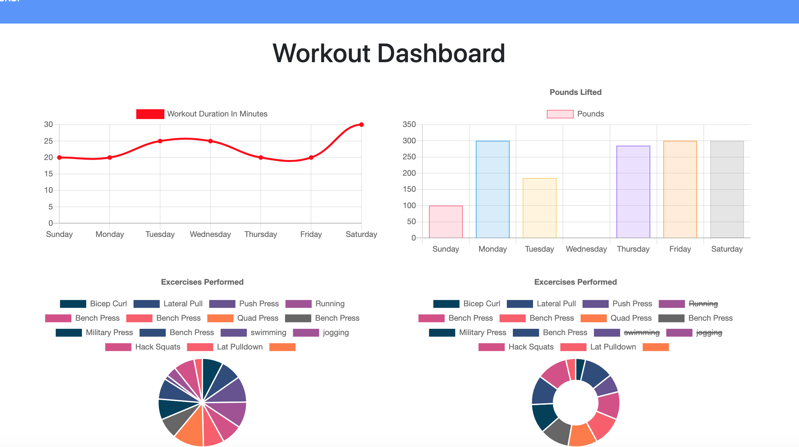
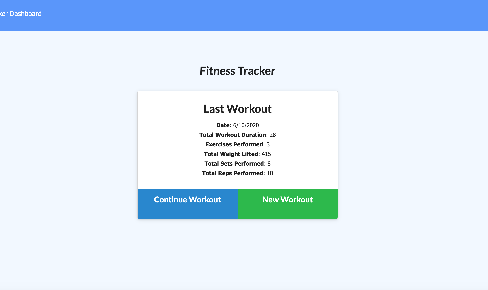

# Fitness Tracker

### **by Roger Pouncey** 

Experience the cleverly-named Fitness Tracker, an app that uses Node, Express, MongoDB, and Mongoose to track your workout progress and help you reach your fitness goals!

Email: rpounceyjr@gmail.com

## **Table of Contents** 

#### i. [Installation](#installation)

#### ii. [Usage](#usage)

#### iii. [Contributing](#contributing)

#### iv. [Tests](#tests)

#### v. [Questions](#questions)

## **Installation** 
 
                $ npm i

## **Usage** 

Fitness tracker is a workout-tracking app that allows the user to create and update workouts, as well as view statistics culled from previous workouts.  From the index page, information about the previous workout is pulled from the database and appended to the DOM. If no workout information exists, a message informs the user that there is no existing workout information.  The user can click one of two buttons, "Continue Workout" or "New Workout."  Continuing a workout redirects the user to the exercise page, passing the ID of the continued workout as a query string.  Starting a new workout creates a POST request which creates the new workout document in the database, passes the new workout's ID as a query string, and directs the user to the exercise page.

From the exercise page, the user inputs information about the workout, including whether the workout was a cardio or resistance exercise, the name of the exercise, amount of weight lifted,
duration of the workout, etc.  Upon clicking either the "Complete" or "Add Exercise" button a PUT request is initiated which uses the ID from the query string as a request parameter and pushes the exercises from the request body into the exercise array of the corresponding database document.  Clicking the "Add Exercise" button allows the user to add more exercises, while the "Complete" button redirects the user to the index page after the update.

In addition to adding and updating workouts, the user may also use this app to view information regarding previous workouts.  Clicking the "Dashboard" button in the navbar of the index page sends the user to the stats page where they may view information such as names of exercises performed, amount of weight lifted, and time spent working out.  The information is displayed in various graphs for easy visualization of these statistics.

## **Contributing** 

This project was created by Roger Pouncey.  Improvements can be made to the app by making a pull request on GitHub.

## **Tests** 

No tests were performed on this app.

## **Questions** 

Questions about this app can be addressed to Roger Pouncey, either through GitHub or via the above email address.